## 编译错误

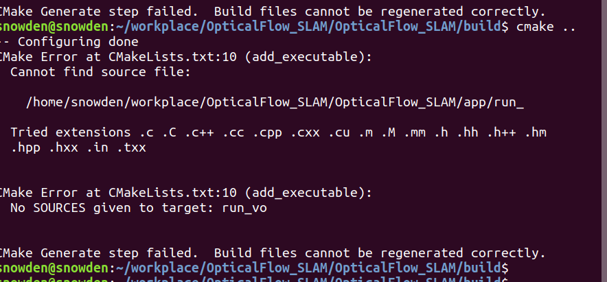

原因分析： 文件命名中间多了一个空格；


**找不到头文件**


问题描述：

​	由于主程序在 app文件夹下，而库文件在algorithm 文件夹下，编译库文件的时候，找不到algorithm 文件夹下面相应的头文件。

原因分析：找不到头文件，说明头文件路径不对

解决办法：include_directories(${PROJECT_SOURCE_DIR})

注意，这个工作路径仅仅在编译的时候有效，在运行的时候无效，运行的时候，都是基于可执行程序所在的路径为工作路径。

**error: ‘Optimizer’ was not declared in this scope** 

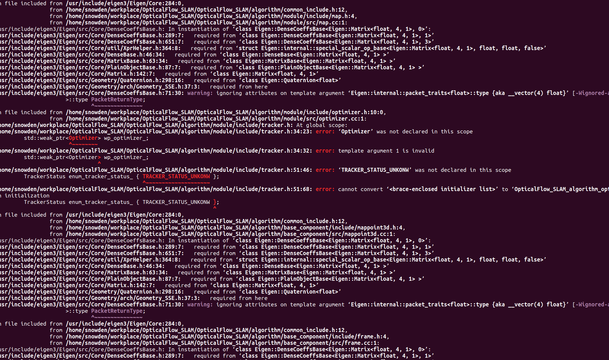


问题描述：  两个头文件中的类互相有指针引用，编译时出错，这时需要前置声明两个类的定义；

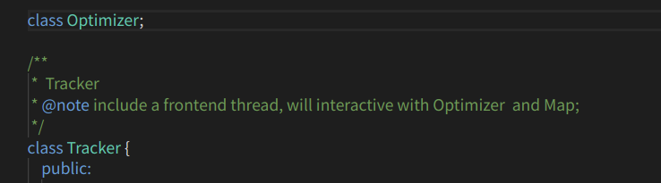


编译错误：

××× 未定义的引用 

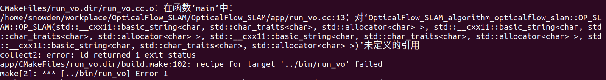

原因分析： 编译的库没链接上；


编译错误：

报错信息：

/usr/local/lib/libgflags.a(gflags.cc.o): relocation R_X86_64_PC32 against symbol `stderr@@GLIBC_2.2.5' can not be used when making a shared object; recompile with -fPIC

最后的链结失败: 错误的值

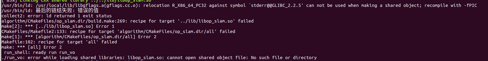

原因分析：之前编译gflags的时候，没有给定编译说明编译成静态库还是动态库，所以在工程中按照动态库进行链接的时候，出现了这个错误（第一次安装完成后，并没有出现这个错误，关键后再开机，就出现了这个问题）

解决办法：应该在编译的时候给定编译结果为动态库还是静态库，cmake .. -DBUILD_SHARED_LIBS=ON

参考链接： https://stackoverflow.com/questions/45691778/cdt-using-lib-a-relocation-r-x86-64-32s-against-symbol-can-not-be-used

​					https://github.com/gflags/gflags/blob/master/INSTALL.md


多线程运行错误：

Thread 1 "run_vo" received signal SIGABRT, Aborted.
__GI_raise (sig=sig@entry=6) at ../sysdeps/unix/sysv/linux/raise.c:51
51	../sysdeps/unix/sysv/linux/raise.c: 没有那个文件或目录.

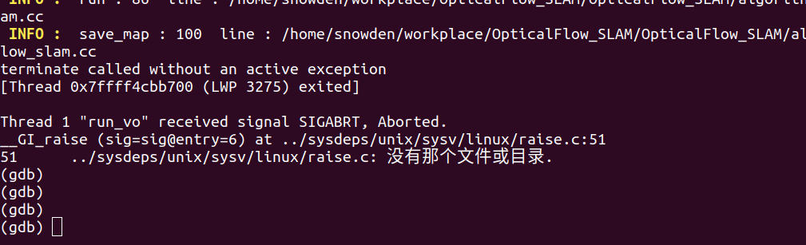

​				

原因： 对于创建的两个线程，在主线程中没有使用join() 进行阻塞，导致主线程提前结束了，


编译错误：

error: extra qualification ‘OpticalFlow_SLAM_algorithm_opticalflow_slam::Tracker::’ on member ‘set_front_end_status’ [-fpermissive]

bool Tracker::set_front_end_status(const FrontEndStatus new_status);

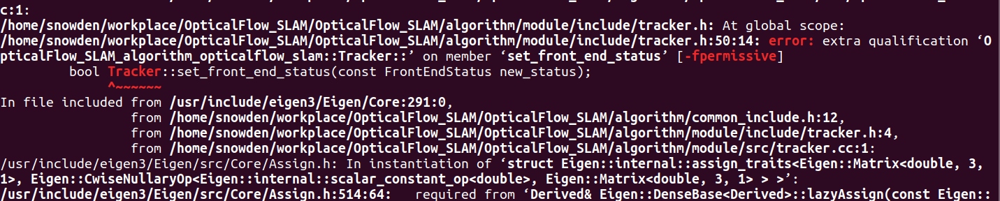


原因：        bool Tracker::set_front_end_status(const FrontEndStatus new_status);在类内声明的时候，不应该加入该类的作用域限定符；

解决办法： 删除Tracker::即可；


运行错误：terminate called without an active exception

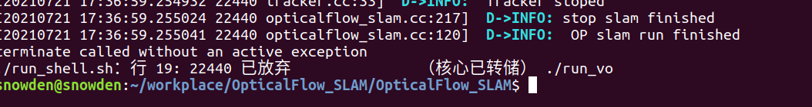

子线程还没有结束的时候，主线程却提前结束了；对任务线程在主线程中加join即可；

https://blog.csdn.net/github_20066005/article/details/79999530


运行异常：

通过主线程调用tarcker的 notify 去通知 viewer 线程 和 optimizer 线程进行终止， 然后去调用 viewer 和 optimizer  的.join阻塞等待，发现系统卡在了这里，不动了；

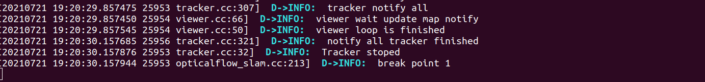

原因分析：还是两个线程没有彻底关闭；

解决方案：调用detach()而不是join()；

```cpp
void Optimizer::stop()
{
        back_end_thread_.detach();
}
```


运行错误：

OpenCV Error: Assertion failed (total() == 0 || data != NULL) in Mat, file /usr/local/include/opencv2/core/mat.inl.hpp, line 443
terminate called after throwing an instance of 'cv::Exception'
  what():  /usr/local/include/opencv2/core/mat.inl.hpp:443: error: (-215) total() == 0 || data != NULL in function Mat

cv::Mat mask(sp_current_frame_->left_image_.size(), CV_8UC1, 0);

Mat(Size size, int type, const Scalar& s); s 设置为0 后，会出现这个问题；

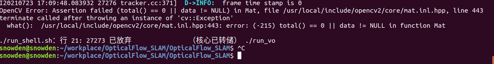

原因未知；

需要更改成cv::Mat mask(sp_current_frame_->left_image_.size(), CV_8UC1, cv::Scalar(0));， 不能直接写0；可能是直接写0会认为是空指针，而mat.data不能用空指针；


Eigen 错误：

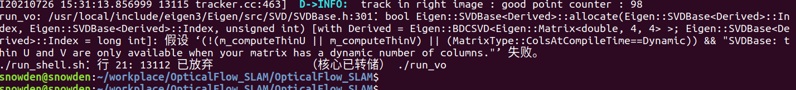

bool Eigen::SVDBase<Derived>::allocate(Eigen::SVDBase<Derived>::Index, Eigen::SVDBase<Derived>::Index, unsigned int) [with Derived = Eigen::BDCSVD<Eigen::Matrix<double, 4, 4> >; Eigen::SVDBase<Derived>::Index = long int]: 假设 ‘(!(m_computeThinU || m_computeThinV) || (MatrixType::ColsAtCompileTime==Dynamic)) && "SVDBase: thin U and V are only available when your matrix has a dynamic number of columns."’ 失败。
./run_shell.sh：行 21: 13112 已放弃               （核心已转储） ./run_vo

原因： auto  svd = A.bdcSvd(Eigen::ComputeThinU | Eigen::ComputeThinV);  在这个表达式中使用这两个参数的化必须要使用动态 matrix; 也就是说A必须是动态的，不能是固定的行列；

## [◆ ](https://eigen.tuxfamily.org/dox/classEigen_1_1BDCSVD.html#a302746d9c534cd513c1df87c7ae4850d)BDCSVD() [3/3]

template<typename _MatrixType >

| [Eigen::BDCSVD](https://eigen.tuxfamily.org/dox/classEigen_1_1BDCSVD.html)< _MatrixType >::[BDCSVD](https://eigen.tuxfamily.org/dox/classEigen_1_1BDCSVD.html)(const MatrixType & *matrix*,unsigned int *computationOptions* = `0` ) | inline |
| ------------------------------------------------------------ | ------ |
|                                                              |        |

Constructor performing the decomposition of given matrix.

- Parameters

  matrixthe matrix to decomposecomputationOptionsoptional parameter allowing to specify if you want full or thin U or V unitaries to be computed. By default, none is computed. This is a bit - field, the possible bits are [ComputeFullU](https://eigen.tuxfamily.org/dox/group__enums.html#ggae3e239fb70022eb8747994cf5d68b4a9a9fa9302d510cee20c26311154937e23f), [ComputeThinU](https://eigen.tuxfamily.org/dox/group__enums.html#ggae3e239fb70022eb8747994cf5d68b4a9aa7fb4e98834788d0b1b0f2b8467d2527), [ComputeFullV](https://eigen.tuxfamily.org/dox/group__enums.html#ggae3e239fb70022eb8747994cf5d68b4a9a36581f7c662f7def31efd500c284f930), [ComputeThinV](https://eigen.tuxfamily.org/dox/group__enums.html#ggae3e239fb70022eb8747994cf5d68b4a9a540036417bfecf2e791a70948c227f47).

**Thin unitaries are only available if your matrix type has a Dynamic number of columns** (for example MatrixXf). They also are not available with the (non - default) [FullPivHouseholderQR](https://eigen.tuxfamily.org/dox/classEigen_1_1FullPivHouseholderQR.html) preconditioner.


参考： https://eigen.tuxfamily.org/dox/classEigen_1_1BDCSVD.html#a39514816d38f9c418cf3f3514b511c2c


Pangolin 链接的时候出错；

/usr/local/include/pangolin/gl/glinclude.h:40：对‘glGetError’未定义的引用
/usr/local/include/pangolin/gl/glinclude.h:42：对‘pangolin::glErrorString(unsigned int)’未定义的引用
CMakeFiles/run_vo.dir/run_vo.cc.o：在函数‘pangolin::GlTexture::~GlTexture()’中：
/usr/local/include/pangolin/gl/gl.hpp:162：对‘pangolin::ShouldQuit()’未定义的引用
/usr/local/include/pangolin/gl/gl.hpp:163：对‘glDeleteTextures’未定义的引用
CMakeFiles/run_vo.dir/run_vo.cc.o：在函数‘pangolin::GlTexture::Bind() const

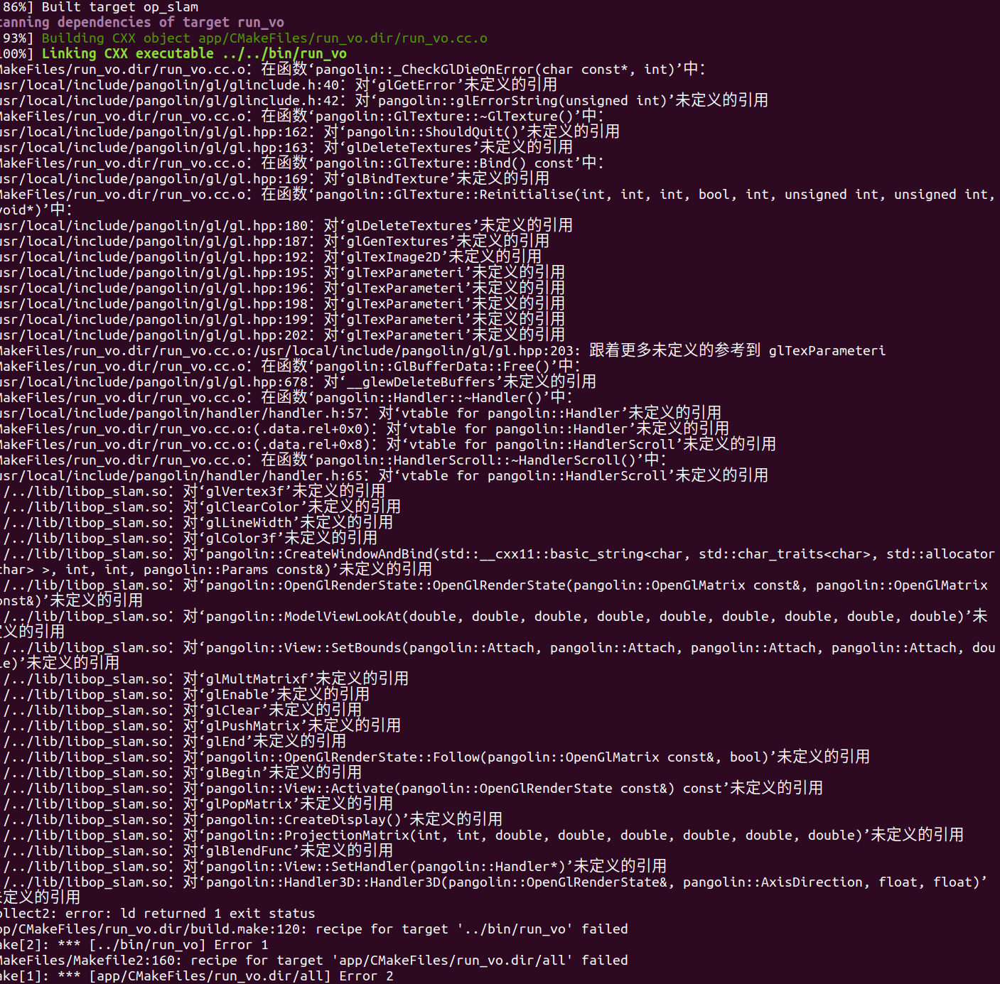

原因分析：可能是依赖库存在问题，卸载重装；

两个原因：第一个，没有链接 pangolin的库，第二个，没有链接pangolin相关的库；

总结：要使用一个库，三步，

1. include_directories(头文件路径)
2. find_package(目标库 REQUIRED)
3. target_link_libraries( 可执行程序，目标库);


pangolin 安装参考：

https://blog.whuzfb.cn/blog/2020/10/21/ubuntu_compile_pangolin/


**错误说明：** 在viewer线程中访问Tracker中的current_frame的时候，出现了段错误；

Thread 2 "run_vo" received signal SIGSEGV, Segmentation fault.
[Switching to Thread 0x7fffe99b6700 (LWP 9467)]
0x00007ffff7ad60ea in std::__shared_ptr<OpticalFlow_SLAM_algorithm_opticalflow_slam::Frame, (__gnu_cxx::_Lock_policy)2>::get (
    this=0x30) at /usr/include/c++/7/bits/shared_ptr_base.h:1258
1258	      { return _M_ptr; }
(gdb) where
#0  0x00007ffff7ad60ea in std::__shared_ptr<OpticalFlow_SLAM_algorithm_opticalflow_slam::Frame, (__gnu_cxx::_Lock_policy)2>::get() const (this=0x30) at /usr/include/c++/7/bits/shared_ptr_base.h:1258
#1  0x00007ffff7ad4ba4 in std::__shared_ptr_access<OpticalFlow_SLAM_algorithm_opticalflow_slam::Frame, (__gnu_cxx::_Lock_policy)2, false, false>::_M_get() const (this=0x30) at /usr/include/c++/7/bits/shared_ptr_base.h:975
#2  0x00007ffff7ad39d0 in std::__shared_ptr_access<OpticalFlow_SLAM_algorithm_opticalflow_slam::Frame, (__gnu_cxx::_Lock_policy)2, false, false>::operator->() const (this=0x30) at /usr/include/c++/7/bits/shared_ptr_base.h:969
#3  0x00007ffff7adac7c in OpticalFlow_SLAM_algorithm_opticalflow_slam::Viewer::update_viewer(pangolin::OpenGlRenderState, pangolin::View&) (this=0x5555557ec2a0, camera=..., displayer=...)
    at /home/snowden/workplace/OpticalFlow_SLAM/OpticalFlow_SLAM/algorithm/module/src/viewer.cc:102

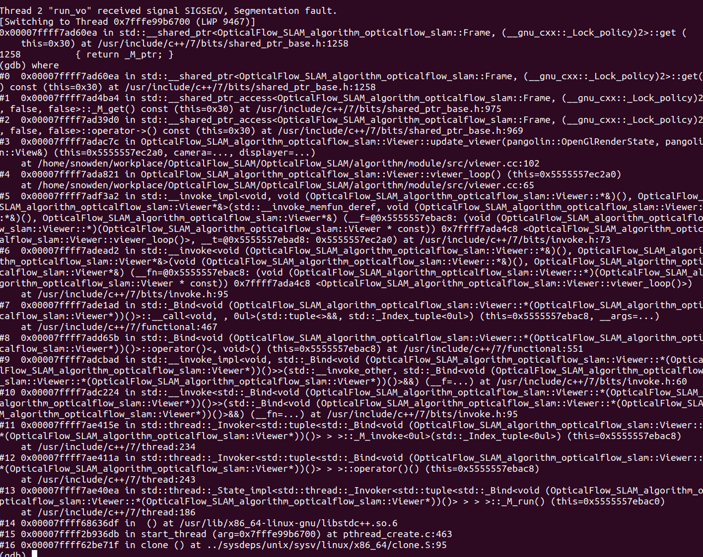

初步判断：可能是由于多线程没有加锁导致了访问同一个内存导致的；

验证： 1，在更新处增加延时，2.查阅相关资料，确认多线程访问同一个变量是否会发生段错误；

初步的解决办法，给current_frame加锁；外边包装一个函数，并且把current_frame 当做一个私有变量；

过程：给制定元素加锁，也依然出现了这个问题，后来把出错地方的weak_ptr转换为 share_ptr 后，就可以了，原因未知；（可能是weak_ptr没有占用权，所以有可能 weak_ptr访问 目标的时候，目标已经释放了？）