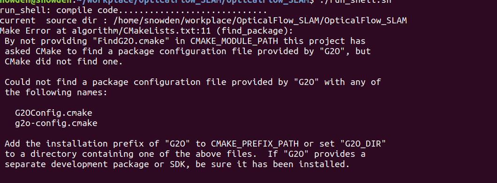
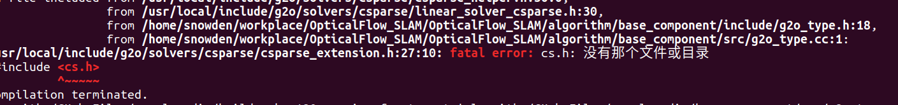
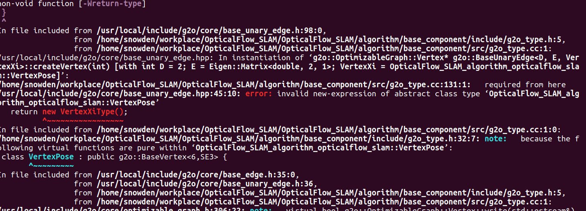
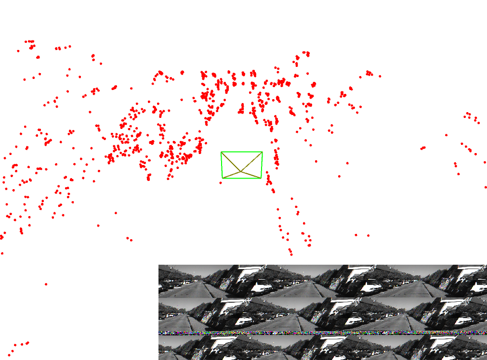
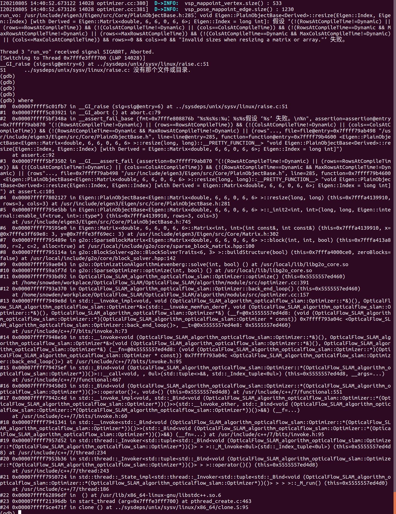

## 编译错误


原因分析： 文件命名中间多了一个空格；


**找不到头文件**


问题描述：

​	由于主程序在 app文件夹下，而库文件在algorithm 文件夹下，编译库文件的时候，找不到algorithm 文件夹下面相应的头文件。

原因分析：找不到头文件，说明头文件路径不对

解决办法：include_directories(${PROJECT_SOURCE_DIR})

注意，这个工作路径仅仅在编译的时候有效，在运行的时候无效，运行的时候，都是基于可执行程序所在的路径为工作路径。

**error: ‘Optimizer’ was not declared in this scope** 


问题描述：  两个头文件中的类互相有指针引用，编译时出错，这时需要前置声明两个类的定义；


编译错误：

××× 未定义的引用 


原因分析： 编译的库没链接上；


编译错误：

报错信息：

/usr/local/lib/libgflags.a(gflags.cc.o): relocation R_X86_64_PC32 against symbol `stderr@@GLIBC_2.2.5' can not be used when making a shared object; recompile with -fPIC

最后的链结失败: 错误的值


原因分析：之前编译gflags的时候，没有给定编译说明编译成静态库还是动态库，所以在工程中按照动态库进行链接的时候，出现了这个错误（第一次安装完成后，并没有出现这个错误，关键后再开机，就出现了这个问题）

解决办法：应该在编译的时候给定编译结果为动态库还是静态库，cmake .. -DBUILD_SHARED_LIBS=ON

参考链接： https://stackoverflow.com/questions/45691778/cdt-using-lib-a-relocation-r-x86-64-32s-against-symbol-can-not-be-used

​					https://github.com/gflags/gflags/blob/master/INSTALL.md


多线程运行错误：

Thread 1 "run_vo" received signal SIGABRT, Aborted.
__GI_raise (sig=sig@entry=6) at ../sysdeps/unix/sysv/linux/raise.c:51
51	../sysdeps/unix/sysv/linux/raise.c: 没有那个文件或目录.


​				

原因： 对于创建的两个线程，在主线程中没有使用join() 进行阻塞，导致主线程提前结束了，


编译错误：

error: extra qualification ‘OpticalFlow_SLAM_algorithm_opticalflow_slam::Tracker::’ on member ‘set_front_end_status’ [-fpermissive]

bool Tracker::set_front_end_status(const FrontEndStatus new_status);


原因：        bool Tracker::set_front_end_status(const FrontEndStatus new_status);在类内声明的时候，不应该加入该类的作用域限定符；

解决办法： 删除Tracker::即可；


运行错误：terminate called without an active exception


子线程还没有结束的时候，主线程却提前结束了；对任务线程在主线程中加join即可；

https://blog.csdn.net/github_20066005/article/details/79999530


运行异常：

通过主线程调用tarcker的 notify 去通知 viewer 线程 和 optimizer 线程进行终止， 然后去调用 viewer 和 optimizer  的.join阻塞等待，发现系统卡在了这里，不动了；


原因分析：还是两个线程没有彻底关闭；

解决方案：调用detach()而不是join()；

```cpp
void Optimizer::stop()
{
        back_end_thread_.detach();
}
```


运行错误：

OpenCV Error: Assertion failed (total() == 0 || data != NULL) in Mat, file /usr/local/include/opencv2/core/mat.inl.hpp, line 443
terminate called after throwing an instance of 'cv::Exception'
  what():  /usr/local/include/opencv2/core/mat.inl.hpp:443: error: (-215) total() == 0 || data != NULL in function Mat

cv::Mat mask(sp_current_frame_->left_image_.size(), CV_8UC1, 0);

Mat(Size size, int type, const Scalar& s); s 设置为0 后，会出现这个问题；


原因未知；

需要更改成cv::Mat mask(sp_current_frame_->left_image_.size(), CV_8UC1, cv::Scalar(0));， 不能直接写0；可能是直接写0会认为是空指针，而mat.data不能用空指针；


Eigen 错误：


bool Eigen::SVDBase<Derived>::allocate(Eigen::SVDBase<Derived>::Index, Eigen::SVDBase<Derived>::Index, unsigned int) [with Derived = Eigen::BDCSVD<Eigen::Matrix<double, 4, 4> >; Eigen::SVDBase<Derived>::Index = long int]: 假设 ‘(!(m_computeThinU || m_computeThinV) || (MatrixType::ColsAtCompileTime==Dynamic)) && "SVDBase: thin U and V are only available when your matrix has a dynamic number of columns."’ 失败。
./run_shell.sh：行 21: 13112 已放弃               （核心已转储） ./run_vo

原因： auto  svd = A.bdcSvd(Eigen::ComputeThinU | Eigen::ComputeThinV);  在这个表达式中使用这两个参数的化必须要使用动态 matrix; 也就是说A必须是动态的，不能是固定的行列；

## [◆ ](https://eigen.tuxfamily.org/dox/classEigen_1_1BDCSVD.html#a302746d9c534cd513c1df87c7ae4850d)BDCSVD() [3/3]

template<typename _MatrixType >

| [Eigen::BDCSVD](https://eigen.tuxfamily.org/dox/classEigen_1_1BDCSVD.html)< _MatrixType >::[BDCSVD](https://eigen.tuxfamily.org/dox/classEigen_1_1BDCSVD.html)(const MatrixType & *matrix*,unsigned int *computationOptions* = `0` ) | inline |
| ------------------------------------------------------------ | ------ |
|                                                              |        |

Constructor performing the decomposition of given matrix.

- Parameters

  matrixthe matrix to decomposecomputationOptionsoptional parameter allowing to specify if you want full or thin U or V unitaries to be computed. By default, none is computed. This is a bit - field, the possible bits are [ComputeFullU](https://eigen.tuxfamily.org/dox/group__enums.html#ggae3e239fb70022eb8747994cf5d68b4a9a9fa9302d510cee20c26311154937e23f), [ComputeThinU](https://eigen.tuxfamily.org/dox/group__enums.html#ggae3e239fb70022eb8747994cf5d68b4a9aa7fb4e98834788d0b1b0f2b8467d2527), [ComputeFullV](https://eigen.tuxfamily.org/dox/group__enums.html#ggae3e239fb70022eb8747994cf5d68b4a9a36581f7c662f7def31efd500c284f930), [ComputeThinV](https://eigen.tuxfamily.org/dox/group__enums.html#ggae3e239fb70022eb8747994cf5d68b4a9a540036417bfecf2e791a70948c227f47).

**Thin unitaries are only available if your matrix type has a Dynamic number of columns** (for example MatrixXf). They also are not available with the (non - default) [FullPivHouseholderQR](https://eigen.tuxfamily.org/dox/classEigen_1_1FullPivHouseholderQR.html) preconditioner.


参考： https://eigen.tuxfamily.org/dox/classEigen_1_1BDCSVD.html#a39514816d38f9c418cf3f3514b511c2c


Pangolin 链接的时候出错；

/usr/local/include/pangolin/gl/glinclude.h:40：对‘glGetError’未定义的引用
/usr/local/include/pangolin/gl/glinclude.h:42：对‘pangolin::glErrorString(unsigned int)’未定义的引用
CMakeFiles/run_vo.dir/run_vo.cc.o：在函数‘pangolin::GlTexture::~GlTexture()’中：
/usr/local/include/pangolin/gl/gl.hpp:162：对‘pangolin::ShouldQuit()’未定义的引用
/usr/local/include/pangolin/gl/gl.hpp:163：对‘glDeleteTextures’未定义的引用
CMakeFiles/run_vo.dir/run_vo.cc.o：在函数‘pangolin::GlTexture::Bind() const


原因分析：可能是依赖库存在问题，卸载重装；

两个原因：第一个，没有链接 pangolin的库，第二个，没有链接pangolin相关的库；

总结：要使用一个库，三步，

1. include_directories(头文件路径)
2. find_package(目标库 REQUIRED)
3. target_link_libraries( 可执行程序，目标库);


pangolin 安装参考：

https://blog.whuzfb.cn/blog/2020/10/21/ubuntu_compile_pangolin/


**错误说明：** 在viewer线程中访问Tracker中的current_frame的时候，出现了段错误；

Thread 2 "run_vo" received signal SIGSEGV, Segmentation fault.
[Switching to Thread 0x7fffe99b6700 (LWP 9467)]
0x00007ffff7ad60ea in std::__shared_ptr<OpticalFlow_SLAM_algorithm_opticalflow_slam::Frame, (__gnu_cxx::_Lock_policy)2>::get (
    this=0x30) at /usr/include/c++/7/bits/shared_ptr_base.h:1258
1258	      { return _M_ptr; }
(gdb) where
#0  0x00007ffff7ad60ea in std::__shared_ptr<OpticalFlow_SLAM_algorithm_opticalflow_slam::Frame, (__gnu_cxx::_Lock_policy)2>::get() const (this=0x30) at /usr/include/c++/7/bits/shared_ptr_base.h:1258
#1  0x00007ffff7ad4ba4 in std::__shared_ptr_access<OpticalFlow_SLAM_algorithm_opticalflow_slam::Frame, (__gnu_cxx::_Lock_policy)2, false, false>::_M_get() const (this=0x30) at /usr/include/c++/7/bits/shared_ptr_base.h:975
#2  0x00007ffff7ad39d0 in std::__shared_ptr_access<OpticalFlow_SLAM_algorithm_opticalflow_slam::Frame, (__gnu_cxx::_Lock_policy)2, false, false>::operator->() const (this=0x30) at /usr/include/c++/7/bits/shared_ptr_base.h:969
#3  0x00007ffff7adac7c in OpticalFlow_SLAM_algorithm_opticalflow_slam::Viewer::update_viewer(pangolin::OpenGlRenderState, pangolin::View&) (this=0x5555557ec2a0, camera=..., displayer=...)
    at /home/snowden/workplace/OpticalFlow_SLAM/OpticalFlow_SLAM/algorithm/module/src/viewer.cc:102


初步判断：可能是由于多线程没有加锁导致了访问同一个内存导致的；

验证： 1，在更新处增加延时，2.查阅相关资料，确认多线程访问同一个变量是否会发生段错误；

初步的解决办法，给current_frame加锁；外边包装一个函数，并且把current_frame 当做一个私有变量；

解决办法：给指定元素加锁，也依然出现了这个问题，后来把出错地方的weak_ptr转换为 share_ptr 后，就可以了，原因未知；（可能是weak_ptr没有占用权，所以有可能 weak_ptr访问 目标的时候，目标已经释放了？）

### G2O 编译错误：



原因： 找不到g2o的配置文件；

需要使用list() 指定 G2O cmake 所在的文件位置；

```
list( APPEND CMAKE_MODULE_PATH /home/×××/g2o/cmake_modules ) 
set(G2O_ROOT /usr/local/include/g2o) 
find_package(G2O REQUIRED) 
include_directories( 
${G2O_INCLUDE_DIRS} ) 
```


### G2O使用错误：



原因： 没有设定 cs.h 的具体位置，在CmakeLists 中添加即可；

```
#Suitesparse
include_directories("/usr/include/suitesparse")
```

这个问题在开机重启后又重新出现；一个零时的解办法是 找到csparse_extension.h这个文件，然后把其中 的 #include <cs.h> 替换成 #include <绝对路径下的cs.h>, 这个应该是csparse 这个库的CmakeLists.txt书写的问题；

### G2O 使用错误；

base_unary_edge.hpp:45:10: error: **invalid new-expression of abstract class type** ‘OpticalFlow_SLAM_algorithm_opticalflow_slam::VertexPose’



原因：有纯虚函数未实现；

具体原因： 有个函数是 function () const ; 这种形式的，但是在重写的时候，写成了function(), 丢掉了const,造成了这个问题，所以， 含有const修饰的函数 和  不含 const的函数，是完全不同的两种函数；

任何不会修改数据成员的函数都应该声明为const 类型。如果在编写const 成员函数时，不慎修改了数据成员，或者调用了其它非const 成员函数，编译器将指出错误，这无疑会提高程序的健壮性。

参考： https://blog.csdn.net/eickandy/article/details/65630511


**Pangolin:**

1. pangolin多窗口时出现这个问题：

pangolin::GlTexture imgTexture1

**"pangolin::GlTexture::GlTexture(const pangolin::GlTexture &)" (已声明 所在行数:121，所属文件:"/usr/local/include/pangolin/gl/gl.h") 不可访问C/C++(330)**

可能原因：限定了构造函数只能使用带参数的构造函数，而在值传递过程中，要调用默认构造函数，而默认构造函数又不可用，所以导致报这个错；

修复办法，所有使用这个对象的，都直接使用引用，而非值传递；

2. pangolin 显示图片过程中出现很多斜纹和噪声点，而且框内不止一个图片，而是多个图片同事出现，尺寸也不对；



 原因未知，目前采用opencv显式来进行替代；


### g2o错误：

在运行优化时出现错误：

```cpp
PlainObjectBase.h:285：void Eigen::PlainObjectBase<Derived>::resize(Eigen::Index, Eigen::Index) [with Derived = Eigen::Matrix<double, 6, 6, 0, 6, 6>; Eigen::Index = long int]: 假设 ‘(!(RowsAtCompileTime!=Dynamic) || (rows==RowsAtCompileTime)) && (!(ColsAtCompileTime!=Dynamic) || (cols==ColsAtCompileTime)) && (!(RowsAtCompileTime==Dynamic && MaxRowsAtCompileTime!=Dynamic) || (rows<=MaxRowsAtCompileTime)) && (!(ColsAtCompileTime==Dynamic && MaxColsAtCompileTime!=Dynamic) || (cols<=MaxColsAtCompileTime)) && rows>=0 && cols>=0 && "Invalid sizes when resizing a matrix or array."’
```




原因分析： 可能是该用动态数组的地方没有用，还需要仔细检查一下；根据错误内容，查找；

查找到原因： 块求解器的大小应该设置成动态的；可能和版本有关系？未知；

解决办法：

将：BlockSolverType->g2o::BlockSolverX

```cpp
        typedef g2o::BlockSolver_6_3  BlockSolverType;
        typedef g2o::LinearSolverDense<BlockSolverType::PoseMatrixType> LinearSolverType;
        auto solver = new   g2o::OptimizationAlgorithmLevenberg(
                                                        g2o::make_unique<BlockSolverType>(
                                                                g2o::make_unique<LinearSolverType>()
                                                        )
                                                );
```

替换为：

```cpp
        typedef g2o::LinearSolverCSparse<g2o::BlockSolverX::PoseMatrixType> LinearSolverType;
        auto solver = new   g2o::OptimizationAlgorithmLevenberg(
                                                        g2o::make_unique<g2o::BlockSolverX>(
                                                                g2o::make_unique<LinearSolverType>()
                                                        )
                                                );
```

参考： https://blog.csdn.net/ziliwangmoe/article/details/88717477


### g2o 优化结束的时候出现问题

```cpp
I20210805 15:59:17.521359 28966 tracker.cc:298]  D->INFO: tracker status is good 
I20210805 15:59:17.559370 28965 optimizer.cc:461]  D->INFO: backend optimize finished , Outlier / Inlier : 20 / 1210

Thread 3 "run_vo" received signal SIGSEGV, Segmentation fault.
[Switching to Thread 0x7fffe3fff700 (LWP 28965)]
0x0000000000000021 in ?? ()
(gdb) 
(gdb) where
#0  0x0000000000000021 in  ()
#1  0x00007ffff58f83d2 in g2o::HyperGraph::clear() () at /usr/local/lib/libg2o_core.so
#2  0x00007ffff5902ea4 in g2o::OptimizableGraph::~OptimizableGraph() () at /usr/local/lib/libg2o_core.so
#3  0x00007ffff7911eae in OpticalFlow_SLAM_algorithm_opticalflow_slam::Optimizer::backend_optimize() (this=0x5555557ed460)
    at /home/snowden/workplace/OpticalFlow_SLAM/OpticalFlow_SLAM/algorithm/module/src/optimizer.cc:251
#4  0x00007ffff7910030 in OpticalFlow_SLAM_algorithm_opticalflow_slam::Optimizer::back_end_loop() (this=0x5555557ed460)
    at /home/snowden/workplace/OpticalFlow_SLAM/OpticalFlow_SLAM/algorithm/module/src/optimizer.cc:157
#5  0x00007ffff791f428 in std::__invoke_impl<void, void (OpticalFlow_SLAM_algorithm_opticalflow_slam::Optimizer::*&)(), OpticalFlow_SLAM_algorithm_opticalflow_slam::Optimizer*&>(std::__invoke_memfun_deref, void (OpticalFlow_SLAM_algorithm_opticalflow_slam::Optimizer::*&)(), OpticalFlow_SLAM_algorithm_opticalflow_slam::Optimizer*&) (__f=@0x5555557ed4d8: (void (OpticalFlow_SLAM_algorithm_opticalflow_slam::Optimizer::*)(OpticalFlow_SLAM_algorithm_opticalflow_slam::Optimizer * const)) 0x7ffff790fd0c <OpticalFlow_SLAM_algorithm_opticalflow_slam::Optimizer::back_end_loop()>, __t=@0x5555557ed4e8: 0x5555557ed460)
    at /usr/include/c++/7/bits/invoke.h:73
#6  0x00007ffff791e4be in std::__invoke<void (OpticalFlow_SLAM_algorithm_opticalflow_slam::Optimizer::*&)(), OpticalFlow_SLAM_algorithm_opticalflow_slam::Optimizer*&>(void (OpticalFlow_SLAM_algorithm_opticalflow_slam::Optimizer::*&)(), OpticalFlow_SLAM_algorithm_opticalflow_slam::Optimizer*&) (__fn=@0x5555557ed4d8: (void (OpticalFlow_SLAM_algorithm_opticalflow_slam::Optimizer::*)(OpticalFlow_SLAM_algorithm_opticalflow_slam::Optimizer * const)) 0x7ffff790fd0c <OpticalFlow_SLAM_algorithm_opticalflow_slam::Optimizer::back_end_loop()>) at /usr/include/c++/7/bits/invoke.h:95
#7  0x00007ffff791ccdd in std::_Bind<void (OpticalFlow_SLAM_algorithm_opticalflow_slam::Optimizer::*(OpticalFlow_SLAM_algorithm_opticalflow_slam::Optimizer*))()>::__call<void, , 0ul>(std::tuple<>&&, std::_Index_tuple<0ul>) (this=0x5555557ed4d8, __args=...)
    at /usr/include/c++/7/functional:467
#8  0x00007ffff791aa47 in std::_Bind<void (OpticalFlow_SLAM_algorithm_opticalflow_slam::Optimizer::*(OpticalFlow_SLAM_algorithm_opticalflow_slam::Optimizer*))()>::operator()<, void>() (this=0x5555557ed4d8) at /usr/include/c++/7/functional:551
#9  0x00007ffff79188f5 in std::__invoke_impl<void, std::_Bind<void (OpticalFlow_SLAM_algorithm_opticalflow_slam::Optimizer::*(OpticalFlow_SLAM_algorithm_opticalflow_slam::Optimizer*))()>>(std::__invoke_other, std::_Bind<void (OpticalFlow_SLAM_algorithm_opticalflow_slam::Optimizer::*(OpticalFlow_SLAM_algorithm_opticalflow_slam::Optimizer*))()>&&) (__f=...)
    at /usr/include/c++/7/bits/invoke.h:60
#10 0x00007ffff791700b in std::__invoke<std::_Bind<void (OpticalFlow_SLAM_algorithm_opticalflow_slam::Optimizer::*(OpticalFlow_SLAM_algorithm_opticalflow_slam::Optimizer*))()>>(std::_Bind<void (OpticalFlow_SLAM_algorithm_opticalflow_slam::Optimizer::*(OpticalFlow_SLAM_algorithm_opticalflow_slam::Optimizer*))()>&&) (__fn=...) at /usr/include/c++/7/bits/invoke.h:95
#11 0x00007ffff792a06e in std::thread::_Invoker<std::tuple<std::_Bind<void (OpticalFlow_SLAM_algorithm_opticalflow_slam::Optimizer::*(OpticalFlow_SLAM_algorithm_opticalflow_slam::Optimizer*))()> > >::_M_invoke<0ul>(std::_Index_tuple<0ul>) (this=0x5555557ed4d8) at /usr/include/c++/7/thread:234
#12 0x00007ffff7926826 in std::thread::_Invoker<std::tuple<std::_Bind<void (OpticalFlow_SLAM_algorithm_opticalflow_slam::Optimizer::*(OpticalFlow_SLAM_algorithm_opticalflow_slam::Optimizer*))()> > >::operator()() (this=0x5555557ed4d8)
    at /usr/include/c++/7/thread:243
#13 0x00007ffff7922d92 in std::thread::_State_impl<std::thread::_Invoker<std::tuple<std::_Bind<void (OpticalFlow_SLAM_algorithm_opticalflow_slam::Optimizer::*(OpticalFlow_SLAM_algorithm_opticalflow_slam::Optimizer*))()> > > >::_M_run() (this=0x5555557ed4d0)
    at /usr/include/c++/7/thread:186
#14 0x00007ffff61fa6df in  () at /usr/lib/x86_64-linux-gnu/libstdc++.so.6
#15 0x00007ffff1c796db in start_thread (arg=0x7fffe3fff700) at pthread_create.c:463
#16 0x00007ffff5c5571f in clone () at ../sysdeps/unix/sysv/linux/x86_64/clone.S:95
(gdb) 

```

HyperGraph::clear() 的具体实现；

```cpp
  void HyperGraph::clear()
  {
#if G2O_DELETE_IMPLICITLY_OWNED_OBJECTS
    for (VertexIDMap::iterator it=_vertices.begin(); it!=_vertices.end(); ++it)
      delete (it->second);
    for (EdgeSet::iterator it=_edges.begin(); it!=_edges.end(); ++it)
      delete (*it);
#endif

    _vertices.clear();
    _edges.clear();
  }
```

猜测原因：

可能是由于在新建节点的时候使用的是share_ptr 来指向新的节点造成的；使用share_ptr 指向的对象不能通过delete 来删除？

解决办法： 将所有涉及到顶点和边的对象都设置为原始指针，而不是使用智能指针；


### unique_lock 错误

```
I20210805 16:56:02.544169 12210 tracker.cc:294]  D->INFO: Frame:  3  timestamp : 0.312729  Tracked 346
I20210805 16:56:02.544179 12210 tracker.cc:298]  D->INFO: tracker status is good 

Thread 3 "run_vo" received signal SIGSEGV, Segmentation fault.
[Switching to Thread 0x7fffe3fff700 (LWP 12209)]
__GI___pthread_mutex_lock (mutex=0x68) at ../nptl/pthread_mutex_lock.c:67
67	../nptl/pthread_mutex_lock.c: 没有那个文件或目录.
(gdb) where
#0  0x00007ffff1c82fd0 in __GI___pthread_mutex_lock (mutex=0x68) at ../nptl/pthread_mutex_lock.c:67
#1  0x00007ffff77a7f13 in __gthread_mutex_lock(__gthread_mutex_t*) (__mutex=0x68)
    at /usr/include/x86_64-linux-gnu/c++/7/bits/gthr-default.h:748
#2  0x00007ffff77a8648 in std::mutex::lock() (this=0x68) at /usr/include/c++/7/bits/std_mutex.h:103
#3  0x00007ffff77a8f5d in std::unique_lock<std::mutex>::lock() (this=0x7fffe3ff6c50) at /usr/include/c++/7/bits/std_mutex.h:267
#4  0x00007ffff77a8bde in std::unique_lock<std::mutex>::unique_lock(std::mutex&) (this=0x7fffe3ff6c50, __m=...)
    at /usr/include/c++/7/bits/std_mutex.h:197
#5  0x00007ffff77a8590 in OpticalFlow_SLAM_algorithm_opticalflow_slam::Feature2d::get_frame_linked() (this=0x0)
    at /home/snowden/workplace/OpticalFlow_SLAM/OpticalFlow_SLAM/algorithm/base_component/src/feature2d.cc:95
#6  0x00007ffff79122d0 in OpticalFlow_SLAM_algorithm_opticalflow_slam::Optimizer::backend_optimize() (this=0x5555557ed460)
    at /home/snowden/workplace/OpticalFlow_SLAM/OpticalFlow_SLAM/algorithm/module/src/optimizer.cc:335

```


### 删除错误： 

```
I20210805 17:03:48.490517 14304 tracker.cc:837]  D->INFO:  insert_mappoints : 242
I20210805 17:03:48.490527 14304 map.cc:39]  D->INFO:   before erase , dsp_actived_mappoints_  num : 405

Thread 4 "run_vo" received signal SIGSEGV, Segmentation fault.
[Switching to Thread 0x7fffe7aa1700 (LWP 14304)]
0x00007ffff77a66bb in __gnu_cxx::__exchange_and_add (__mem=0x4026170b8cfbfc6d, __val=-1)
    at /usr/include/c++/7/ext/atomicity.h:49
49	  { return __atomic_fetch_add(__mem, __val, __ATOMIC_ACQ_REL); }
(gdb) where
#0  0x00007ffff77a66bb in __gnu_cxx::__exchange_and_add(_Atomic_word volatile*, int) (__mem=0x4026170b8cfbfc6d, __val=-1)
    at /usr/include/c++/7/ext/atomicity.h:49
#1  0x00007ffff77a6752 in __gnu_cxx::__exchange_and_add_dispatch(_Atomic_word*, int) (__mem=0x4026170b8cfbfc6d, __val=-1)
    at /usr/include/c++/7/ext/atomicity.h:82
#2  0x00007ffff77a74e7 in std::_Sp_counted_base<(__gnu_cxx::_Lock_policy)2>::_M_release() (this=0x4026170b8cfbfc65)
    at /usr/include/c++/7/bits/shared_ptr_base.h:151
#3  0x00007ffff77a7307 in std::__shared_count<(__gnu_cxx::_Lock_policy)2>::~__shared_count() (this=0x7fffd9a98348, __in_chrg=<optimized out>) at /usr/include/c++/7/bits/shared_ptr_base.h:684
#4  0x00007ffff77a87c8 in std::__shared_ptr<OpticalFlow_SLAM_algorithm_opticalflow_slam::Mappoint3d, (__gnu_cxx::_Lock_policy)2>::~__shared_ptr() (this=0x7fffd9a98340, __in_chrg=<optimized out>) at /usr/include/c++/7/bits/shared_ptr_base.h:1123
#5  0x00007ffff77a87e4 in std::shared_ptr<OpticalFlow_SLAM_algorithm_opticalflow_slam::Mappoint3d>::~shared_ptr() (this=0x7fffd9a98340, __in_chrg=<optimized out>) at /usr/include/c++/7/bits/shared_ptr.h:93
#6  0x00007ffff790eaff in std::_Destroy<std::shared_ptr<OpticalFlow_SLAM_algorithm_opticalflow_slam::Mappoint3d> >(std::shared_ptr<OpticalFlow_SLAM_algorithm_opticalflow_slam::Mappoint3d>*) (__pointer=0x7fffd9a98340)
    at /usr/include/c++/7/bits/stl_construct.h:98
#7  0x00007ffff790daf0 in std::_Destroy_aux<false>::__destroy<std::shared_ptr<OpticalFlow_SLAM_algorithm_opticalflow_slam::Mappoint3d>*>(std::shared_ptr<OpticalFlow_SLAM_algorithm_opticalflow_slam::Mappoint3d>*, std::shared_ptr<OpticalFlow_SLAM_algorithm_opticalflow_slam::Mappoint3d>*) (__first=0x7fffd9a98340, __last=0x7fffd9a98540) at /usr/include/c++/7/bits/stl_construct.h:108
#8  0x00007ffff790be02 in std::_Destroy<std::shared_ptr<OpticalFlow_SLAM_algorithm_opticalflow_slam::Mappoint3d>*>(std::shared_ptr<OpticalFlow_SLAM_algorithm_opticalflow_slam::Mappoint3d>*, std::shared_ptr<OpticalFlow_SLAM_algorithm_opticalflow_slam::Mappoint3d>*) (__first=0x7fffd9a98340, __last=0x7fffd9a98540) at /usr/include/c++/7/bits/stl_construct.h:137
#9  0x00007ffff790a0db in std::_Destroy<std::shared_ptr<OpticalFlow_SLAM_algorithm_opticalflow_slam::Mappoint3d>*, std::shared_ptr<OpticalFlow_SLAM_algorithm_opticalflow_slam::Mappoint3d> >(std::shared_ptr<OpticalFlow_SLAM_algorithm_opticalflow_slam::Mappoint3d>*, std::shared_ptr<OpticalFlow_SLAM_algorithm_opticalflow_slam::Mappoint3d>*, std::allocator<std::shared_ptr<OpticalFlow_SLAM_algorithm_opticalflow_slam::Mappoint3d> >&) (__first=0x7fffd9a98340, __last=0x7fffd9a98540)

```

出错位置： 在删除被激活的地图点的时候出错，可能是因为地图点被不同的关键帧关联了，在帧弹出后，另一帧还在关联着已经被删除的地图点，而这一帧再弹出时，就会删除空指针，所以这里需要改变一下删除策略，目前一个想法是标记每个地图点的所有者，这里删除的时候，只删除所有者的，但是也是存在问题，后面的关键帧就没有办法关联这个地图点了，所以，解决办法应该是删除观测者只有本帧的地图点；(不对，删除的只是对地图点的引用，并没有实际删除地图点)