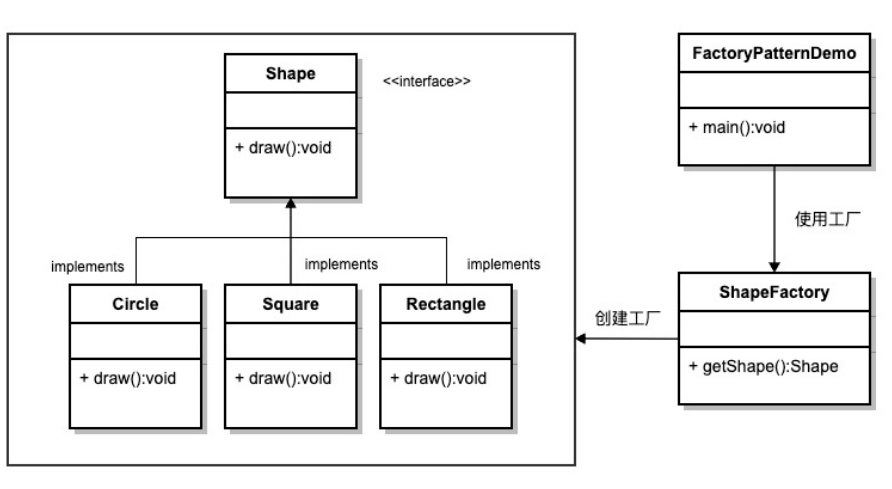
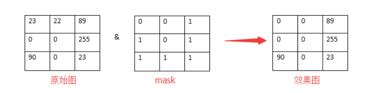
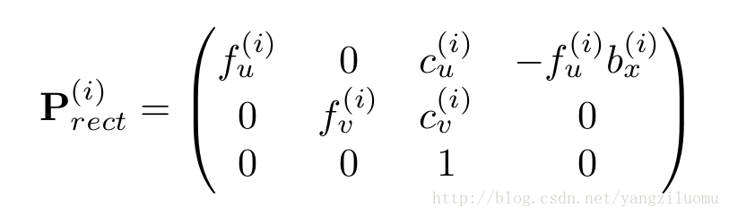
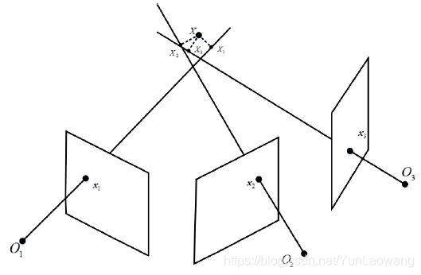
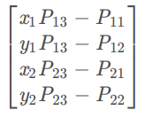
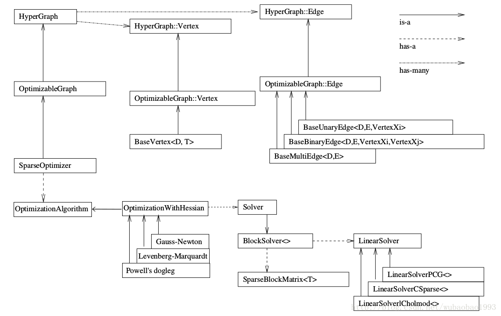

### 工厂模式

通俗的说，工厂模式就是设计一个统一的订货接口，然后让一个工厂类去实现这个接口，用户只需要告诉工厂类需要什么样的产品，工厂类根据用于需求，产生不同的商品；



参考：https://www.runoob.com/design-pattern/factory-pattern.html

### 单例模式

```cpp
/*饿汉模式  初始化的时候，直接就创建了对象；
* 缺点： 只能使用默认的构造函数，无法使用外部参数对其进行初始化；
* 优点： 由于在创建类的时候就进行了对象的定义，所以不存在多线程竞争的影响；
*/
public class Singleton {  
    private static Singleton instance = new Singleton();  
    private Singleton (){}  
    public static Singleton getInstance() {  
    return instance;  
    }  
}

/** 懒汉模式（饱汉模式) 之 双重检测锁模式；
* 缺点： 加锁会在一定程度上影响性能；
* 优点：线程安全，且相对于直接加锁的方式，双重检测模式效率更高。
*/
public class Singleton {  
    private volatile static Singleton singleton;  
    private Singleton (){}  
    public static Singleton getSingleton() {  
    if (singleton == null) {  
        synchronized (Singleton.class) {  
        if (singleton == null) {  
            singleton = new Singleton();  
        }  
        }  
    }  
    return singleton;  
    }  
}
```

参考链接：https://www.runoob.com/design-pattern/singleton-pattern.html

### 静态成员变量需要在类外进行初始化

初始化的时候需要使用作用域限定符和 具体类型；

```cpp
class sample{
   int var;
   static int count;
  
   public:
};
int sample::count = 0;                 //static variable initialisation
int main()
{

}+
```


### 使用=delete 去 disable 一些函数；

> 目标： disable 掉一些运算操作 或者 函数；

> 使用时机： 在首次申明这个函数的时候，就要使用= delete进行设置

该特性是在C++11才引入的，所以之前的版本是无法使用的；

```cpp
	class B{
public:
  B(int){}                
  B(double) = delete;   // Declare the conversioin constructor as a deleted function
};

int main(){
  B b1(1);        
  B b2(100.1);          // Error, conversion from double to class B is disabled.
}
```

```cpp
class C {
public:  
  C();
};

C::C() = delete;    // Error, the deleted definition of function C must be
                    // the first declaration of the function.
```

参考链接：https://www.ibm.com/docs/en/i/7.3?topic=definitions-deleted-functions-c11

### CmakeLists.txt 中将某一文件夹下的所有文件当做源文件的方法；

- 下面语句将会把./src目录下所有符合*.cpp结尾的文件存入USER_LIBS_PATH变量中，

```cmake
file(GLOB USER_LIBS_PATH ./src/*.cpp)
1
```

*如果我们不但在当前目录需要引入，还需要在当前目录子目录引入了，这里就直接使用GLOB_RECURSE*

```cmake
file(GLOB_RECURSE USER_LIBS_PATH ./src/*.cpp)
```

```cmake
 file( GLOB ALGORITHM_SRC */src/*.cc)
message(" ALGORITHM_SRC : " ${ALGORITHM_SRC})
add_library(op_slam SHARED 
        ${ALGORITHM_SRC}
        )
```

参考链接：https://blog.csdn.net/qq_31261509/article/details/88692736

​				   http://www.voidcn.com/article/p-urttzyjn-buo.html


### GLOG 

等级：

INFO, WARNING,ERROR,FATAL

可配置参数 Setting Flags：

`logtostderr` *(*`bool`*, default=*`false`*)*

`stderrthreshold` *(*`int`*, default=2, which is* `ERROR`*)*

`minloglevel` *(*`int`*, default=0, which is* `INFO`*)*

`v` *(*`int`*, default=0)*

**note**: 这些参数直接配合 gflags 库使用会更好，可以运行命令中加入上述参数，进行设置；具体参考

[链接](https://github.com/google/glog#severity-levels)

使用案例：

```cpp
#include <glog/logging.h>

int main(int argc, char* argv[]) {
    // Initialize Google’s logging library.
    google::InitGoogleLogging(argv[0]);

    // ...
    LOG_INFO << "Found " << num_cookies << " cookies";
    DLOG_INFO << "Found cookies";
	DLOG_if (INFO, num_cookies > 10) << "Got lots of cookies";
    CHECK(fp->Write(x) == 4) << "Write failed!";
    CHECK_NE(1, 2) << ": The world must be ending!";
    CHECK_EQ(string("abc")[1], ’b’);
    CHECK_EQ(some_ptr, static_cast<SomeType*>(NULL));
    CHECK_NOTNULL(some_ptr);
}
```

参考链接： https://github.com/google/glog#severity-levels

​					https://www.jianshu.com/p/2179938a818d

​					http://www.yeolar.com/note/2014/12/14/gflags/


### std::thread

**头文件** 

#include <thread>

**线程的创建**

```cpp
int main()
{
    int n = 0;
    std::thread t1; // t1 is not a thread
    std::thread t2(f1, n + 1); // pass by value
    std::thread t3(f2, std::ref(n)); // pass by reference
    std::thread t4(std::move(t3)); // t4 is now running f2(). t3 is no longer a thread
    t2.join();
    t4.join();
    std::cout << "Final value of n is " << n << '\n';
}
```

**线程相关其他函数**

```cpp
//get_id
  std::thread t2(foo);
  std::thread::id t2_id = t2.get_id();
std::this_thread::get_id();

//joinable
//检查线程是否可被 join。检查当前的线程对象是否表示了一个活动的执行线程，由默认构造函数创建的线程是不能被 join 的。
void foo()
{
  std::this_thread::sleep_for(std::chrono::seconds(1));
}
int main()
{
  std::thread t;
  std::cout << "before starting, joinable: " << t.joinable() << '\n';

  t = std::thread(foo);
  std::cout << "after starting, joinable: " << t.joinable() << '\n';

  t.join();
}

//detach
/*
Detach 线程。 将当前线程对象所代表的执行实例与该线程对象分离，使得线程的执行可以单独进行。一旦线程执行完毕，它所分配的资源将会被释放。
调用 detach 函数之后：
1. *this 不再代表任何的线程执行实例。
2. joinable() == false
3. get_id() == std::thread::id()
*/
std::thread t(independentThread);
t.detach();

//swap: 
//Swap 线程，交换两个线程对象所代表的底层句柄(underlying handles)。
  std::thread t1(foo);
  std::thread t2(bar);
  std::swap(t1, t2);
  t1.swap(t2);


//pthread_setschedparam 
//设置线程的优先级；

  std::thread t1(f, 1), t2(f, 2);
  sched_param sch;
  int policy; 
  pthread_getschedparam(t1.native_handle(), &policy, &sch);
  sch.sched_priority = 20;
  if (pthread_setschedparam(t1.native_handle(), SCHED_FIFO, &sch)) {
      std::cout << "Failed to setschedparam: " << std::strerror(errno) << '\n';
  }

// hardware_concurrency 
// 检测硬件并发特性，返回当前平台的线程实现所支持的线程并发数目，但返回值仅仅只作为系统提示(hint)。
#include <iostream>
#include <thread>
 
int main() {
    unsigned int n = std::thread::hardware_concurrency();
    std::cout << n << " concurrent threads are supported.\n";
}

//多线程加锁
std::mutex g_display_mutex;
void foo()
{
  std::thread::id this_id = std::this_thread::get_id();
  g_display_mutex.lock();
  std::cout << "thread " << this_id << " sleeping...\n";
  g_display_mutex.unlock();
  std::this_thread::sleep_for(std::chrono::seconds(1));
}
int main()
{
  std::thread t1(foo);
  std::thread t2(foo);
  t1.join();
  t2.join();
}

//yield 
//当前线程放弃执行，通知操作系统调度另一个线程继续执行；
void little_sleep(std::chrono::microseconds us)
{
  auto start = std::chrono::high_resolution_clock::now();
  auto end = start + us;
  do {
      std::this_thread::yield();
  } while (std::chrono::high_resolution_clock::now() < end);
}

//sleep_until
// 线程休眠至某个指定的时刻(time point)，该线程才被重新唤醒。
template< class Clock, class Duration >
void sleep_until( const std::chrono::time_point<Clock,Duration>& sleep_time );

//sleep_for
//线程休眠某个指定的时间片(time span)，该线程才被重新唤醒，不过由于线程调度等原因，实际休眠时间可能比 sleep_duration 所表示的时间片更长。
int main()
{
  std::cout << "Hello waiter" << std::endl;
  std::chrono::milliseconds dura( 2000 );
  std::this_thread::sleep_for( dura );
  std::cout << "Waited 2000 ms\n";
}

```

**note**

使用线程库之前，在CMakelists.txt中，首先要进行链接： target_link_libraries(project_name  pthread)

参考链接： https://www.cnblogs.com/adorkable/p/12722209.html

​					https://www.runoob.com/w3cnote/cpp-std-thread.html


### std::mutex

常用函数：

| [lock](https://en.cppreference.com/w/cpp/thread/mutex/lock)  | locks the mutex, blocks if the mutex is not available (public member function) |
| ------------------------------------------------------------ | ------------------------------------------------------------ |
| [try_lock](https://en.cppreference.com/w/cpp/thread/mutex/try_lock) | tries to lock the mutex, **returns if the mutex is not available** (public member function)On **successful lock acquisition returns true, otherwise returns false.** |
| [unlock](https://en.cppreference.com/w/cpp/thread/mutex/unlock) | unlocks the mutex (public member function)                   |

 但是不经常使用std::mutex

>`std::mutex` is usually not accessed directly: [std::unique_lock](https://en.cppreference.com/w/cpp/thread/unique_lock), [std::lock_guard](https://en.cppreference.com/w/cpp/thread/lock_guard), or [std::scoped_lock](https://en.cppreference.com/w/cpp/thread/scoped_lock) (since C++17) manage locking in a more exception-safe manner.

```示例代码
#include <iostream>
#include <map>
#include <string>
#include <chrono>
#include <thread>
#include <mutex>
 
std::map<std::string, std::string> g_pages;
std::mutex g_pages_mutex;
 
void save_page(const std::string &url)
{
    // simulate a long page fetch
    std::this_thread::sleep_for(std::chrono::seconds(2));
    std::string result = "fake content";
 
    std::lock_guard<std::mutex> guard(g_pages_mutex);
    g_pages[url] = result;
}
 
int main() 
{
    std::thread t1(save_page, "http://foo");
    std::thread t2(save_page, "http://bar");
    t1.join();
    t2.join();
 
    // safe to access g_pages without lock now, as the threads are joined
    for (const auto &pair : g_pages) {
        std::cout << pair.first << " => " << pair.second << '\n';
    }
}
```


### std::unique_lock

**为什么不用std::mutex , 而要用 std::unique_lock?**

> The class unique_lock is a general-purpose mutex ownership wrapper allowing deferred locking, time-constrained attempts at locking, recursive locking, transfer of lock ownership, and use with condition variables.


**常用函数**

| [lock](https://en.cppreference.com/w/cpp/thread/unique_lock/lock) | locks (i.e., takes ownership of) the associated mutex (public member function) |
| ------------------------------------------------------------ | ------------------------------------------------------------ |
| [try_lock](https://en.cppreference.com/w/cpp/thread/unique_lock/try_lock) | tries to lock (i.e., takes ownership of) the associated mutex without blocking (public member function) |
| [try_lock_for](https://en.cppreference.com/w/cpp/thread/unique_lock/try_lock_for) | attempts to lock (i.e., takes ownership of) the associated [*TimedLockable*](https://en.cppreference.com/w/cpp/named_req/TimedLockable) mutex, returns if the mutex has been unavailable for the specified time duration (public member function) |
| [try_lock_until](https://en.cppreference.com/w/cpp/thread/unique_lock/try_lock_until) | tries to lock (i.e., takes ownership of) the associated [*TimedLockable*](https://en.cppreference.com/w/cpp/named_req/TimedLockable) mutex, returns if the mutex has been unavailable until specified time point has been reached (public member function) |
| [unlock](https://en.cppreference.com/w/cpp/thread/unique_lock/unlock) | unlocks (i.e., releases ownership of) the associated mutex (public member function) |
| [swap](https://en.cppreference.com/w/cpp/thread/unique_lock/swap) | swaps state with another **std::unique_lock** (public member function) |

| [mutex](https://en.cppreference.com/w/cpp/thread/unique_lock/mutex) | returns a pointer to the associated mutex (public member function) |
| ------------------------------------------------------------ | ------------------------------------------------------------ |
| [owns_lock](https://en.cppreference.com/w/cpp/thread/unique_lock/owns_lock) | tests whether the lock owns (i.e., has locked) its associated mutex (public member function)   for example : lck.owns_lock() |

```cpp
#include <mutex>
#include <thread>
#include <chrono>
 
struct Box {
    explicit Box(int num) : num_things{num} {}
 
    int num_things;
    std::mutex m;
};
 
void transfer(Box &from, Box &to, int num)
{
    // don't actually take the locks yet
    std::unique_lock<std::mutex> lock1(from.m, std::defer_lock);
    std::unique_lock<std::mutex> lock2(to.m, std::defer_lock);
 
    // lock both unique_locks without deadlock
    std::lock(lock1, lock2);
 
    from.num_things -= num;
    to.num_things += num;
 
    // 'from.m' and 'to.m' mutexes unlocked in 'unique_lock' dtors
}
 
int main()
{
    Box acc1(100);
    Box acc2(50);
 
    std::thread t1(transfer, std::ref(acc1), std::ref(acc2), 10);
    std::thread t2(transfer, std::ref(acc2), std::ref(acc1), 5);
 
    t1.join();
    t2.join();
}
```


### std::atomic

**常用函数**

| [operator=](https://en.cppreference.com/w/cpp/atomic/atomic/operator%3D) | stores a value into an atomic object (public member function) |
| ------------------------------------------------------------ | ------------------------------------------------------------ |
| [is_lock_free](https://en.cppreference.com/w/cpp/atomic/atomic/is_lock_free) | checks if the atomic object is lock-free (public member function) |
| [store](https://en.cppreference.com/w/cpp/atomic/atomic/store) | atomically replaces the value of the atomic object with a non-atomic argument (public member function) |
| [load](https://en.cppreference.com/w/cpp/atomic/atomic/load) | atomically obtains the value of the atomic object (public member function) |

| [wait](https://en.cppreference.com/w/cpp/atomic/atomic/wait)(C++20) | blocks the thread until notified and the atomic value changes (public member function) |
| ------------------------------------------------------------ | ------------------------------------------------------------ |
| [notify_one](https://en.cppreference.com/w/cpp/atomic/atomic/notify_one)(C++20) | notifies at least one thread waiting on the atomic object (public member function) |
| [notify_all](https://en.cppreference.com/w/cpp/atomic/atomic/notify_all)(C++20) | notifies all threads blocked waiting on the atomic object (public member function) |

| [fetch_add](https://en.cppreference.com/w/cpp/atomic/atomic/fetch_add) | atomically adds the argument to the value stored in the atomic object and obtains the value held previously (public member function) |
| ------------------------------------------------------------ | ------------------------------------------------------------ |
| [fetch_sub](https://en.cppreference.com/w/cpp/atomic/atomic/fetch_sub) | atomically subtracts the argument from the value stored in the atomic object and obtains the value held previously (public member function) |
| [fetch_and](https://en.cppreference.com/w/cpp/atomic/atomic/fetch_and) | atomically performs bitwise AND between the argument and the value of the atomic object and obtains the value held previously (public member function) |
| [fetch_or](https://en.cppreference.com/w/cpp/atomic/atomic/fetch_or) | atomically performs bitwise OR between the argument and the value of the atomic object and obtains the value held previously (public member function) |
| [fetch_xor](https://en.cppreference.com/w/cpp/atomic/atomic/fetch_xor) | atomically performs bitwise XOR between the argument and the value of the atomic object and obtains the value held previously (public member function) |

```cpp
// constructing atomics
#include <iostream>       // std::cout
#include <atomic>         // std::atomic, std::atomic_flag, ATOMIC_FLAG_INIT
#include <thread>         // std::thread, std::this_thread::yield
#include <vector>         // std::vector

std::atomic<bool> ready (false);
std::atomic_flag winner = ATOMIC_FLAG_INIT;

void count1m (int id) {
  while (!ready) { std::this_thread::yield(); }      // wait for the ready signal
  for (volatile int i=0; i<1000000; ++i) {}          // go!, count to 1 million
  if (!winner.test_and_set()) { std::cout << "thread #" << id << " won!\n"; }
};

int main ()
{
  std::vector<std::thread> threads;
  std::cout << "spawning 10 threads that count to 1 million...\n";
  for (int i=1; i<=10; ++i) threads.push_back(std::thread(count1m,i));
  ready = true;
  for (auto& th : threads) th.join();

  return 0;
}
```


### std::condition_variable

作用：线程间通信的机制，通过一个线程去唤醒另一个线程或者另外其他所有线程；

主要功能函数

- [**wait**](https://www.cplusplus.com/reference/condition_variable/condition_variable/wait/)

  Wait until notified (public member function )

- [**wait_for**](https://www.cplusplus.com/reference/condition_variable/condition_variable/wait_for/)

  Wait for timeout or until notified (public member function )

- [**wait_until**](https://www.cplusplus.com/reference/condition_variable/condition_variable/wait_until/)

  Wait until notified or time point (public member function )

- [**notify_one**](https://www.cplusplus.com/reference/condition_variable/condition_variable/notify_one/)

  Notify one (public member function )

- [**notify_all**](https://www.cplusplus.com/reference/condition_variable/condition_variable/notify_all/)

  Notify all (public member function )

运行示例

```cpp
// condition_variable example
#include <iostream>           // std::cout
#include <thread>             // std::thread
#include <mutex>              // std::mutex, std::unique_lock
#include <condition_variable> // std::condition_variable

std::mutex mtx;
std::condition_variable cv;
bool ready = false;

void print_id (int id) {
  std::unique_lock<std::mutex> lck(mtx);
  while (!ready) cv.wait(lck);
  // ...
  std::cout << "thread " << id << '\n';
}

void go() {
  std::unique_lock<std::mutex> lck(mtx);
  ready = true;
  cv.notify_all();
}

int main ()
{
  std::thread threads[10];
  // spawn 10 threads:
  for (int i=0; i<10; ++i)
    threads[i] = std::thread(print_id,i);

  std::cout << "10 threads ready to race...\n";
  go();                       // go!

  for (auto& th : threads) th.join();

  return 0;
}
```

参考链接：https://www.cplusplus.com/reference/condition_variable/condition_variable/


**有关atomic 、 condition_variable 、unique_lock 和 mutex 的通俗解释**

个人理解： mutex 提供了底层的锁机制，而unique_lock 是对mutex的一种包装，在mutex的基础上提供了其他一些机制，比如延时锁，atomic是为了让变量在操作过程中不被其他线程干扰，从而可以执行原子操作，condition_variable 执行的是多个线程之间的通信；

总的来说： atomic 、 mutex 和 unique_lock 主要实现的是线程之间的互斥机制；

​					atomic 主要是针对一个变量上的操作，避免频繁使用加锁解锁；

​					unique_lock 和 mutex 主要用于 多语句之间的加锁解锁，多使用unique_lock，其接口更加丰富，而且可以直接作为条件变量的参数；

​                    condition_variable 主要为了实现线程之间的同步机制；

其他博主理解：https://zhuanlan.zhihu.com/p/136861784


### std::bind

目的： 给原有函数进行一次包装，对相应的参数进行指定或者改变，只是改变外部接口，并不改变内部逻辑，可以设置一些默认参数，或者通过多个参数来计算出一个新的值，交给底层去处理；主要是为了应对接口的变化；

> The function template `bind` generates a forwarding call wrapper for `f`. Calling this wrapper is equivalent to invoking `f` with some of its arguments bound to `args`.

参考链接：https://en.cppreference.com/w/cpp/utility/functional/bind

​				   https://blog.csdn.net/qq_37653144/article/details/79285221

```cpp

#include <iostream>
#include <functional>
 
void fn(int n1, int n2, int n3) {
	std::cout << n1 << " " << n2 << " " << n3 << std::endl;
}
 
int fn2() {
	std::cout << "fn2 has called.\n";
	return -1;
}
 
int main()
{
	using namespace std::placeholders;
	auto bind_test1 = std::bind(fn, 1, 2, 3);
	auto bind_test2 = std::bind(fn, _1, _2, _3);
	auto bind_test3 = std::bind(fn, 0, _1, _2);
	auto bind_test4 = std::bind(fn, _2, 0, _1);
 
	bind_test1();//输出1 2 3
	bind_test2(3, 8, 24);//输出3 8 24
	bind_test2(1, 2, 3, 4, 5);//输出1 2 3，4和5会被丢弃
	bind_test3(10, 24);//输出0 10 24
	bind_test3(10, fn2());//输出0 10 -1
	bind_test3(10, 24, fn2());//输出0 10 24，fn2会被调用，但其返回值会被丢弃
	bind_test4(10, 24);//输出24 0 10
	return 0;

```

​					


### 智能指针VS 常规指针

weak_ptr 的使用：

​	weak_ptr 不能直接访问所指对象的内容，而是要先获得临时所有权才可以，这个可以通过 .lock()函数来实现；

> `std::weak_ptr` is a smart pointer that holds a non-owning ("weak") reference to an object that is managed by [std::shared_ptr](https://en.cppreference.com/w/cpp/memory/shared_ptr). It must be converted to [std::shared_ptr](https://en.cppreference.com/w/cpp/memory/shared_ptr) in order to access the referenced object.
>
> If the original [std::shared_ptr](https://en.cppreference.com/w/cpp/memory/shared_ptr) is destroyed at this time, the object's lifetime is extended until the temporary [std::shared_ptr](https://en.cppreference.com/w/cpp/memory/shared_ptr) is destroyed as well.

常用函数：

| [reset](https://en.cppreference.com/w/cpp/memory/weak_ptr/reset) | releases the ownership of the managed object             |
| ------------------------------------------------------------ | -------------------------------------------------------- |
| [expired](https://en.cppreference.com/w/cpp/memory/weak_ptr/expired) | checks whether the referenced object was already deleted |

| [lock](https://en.cppreference.com/w/cpp/memory/weak_ptr/lock) | creates a `shared_ptr` that manages the referenced object |
| ------------------------------------------------------------ | --------------------------------------------------------- |
|                                                              |                                                           |

使用案例

```cpp
wp_map_.lock()->condition_var_is_map_updated_.wait(wp_map_.lock()->data_lock_);
```


参考链接：

https://en.cppreference.com/w/cpp/memory/weak_ptr

### 类型转换对比


### 关键词explict


### C++的异常机制, C++为什么不推荐使用异常，而是使用错误码和断言？


### typedefs

**typedef** - creates an alias that can be used anywhere in place of a (possibly complex) type name.

```cpp
// simple typedef
typedef unsigned long ulong;
 
// the following two objects have the same type
unsigned long l1;
ulong l2;
 
// more complicated typedef
typedef int int_t, *intp_t, (&fp)(int, ulong), arr_t[10];
 
// the following two objects have the same type
int a1[10];
arr_t a2;
 
// common C idiom to avoid having to write "struct S"
typedef struct {int a; int b;} S, *pS;
 
// the following two objects have the same type
pS ps1;
S* ps2;
 
// error: storage-class-specifier cannot appear in a typedef declaration
// typedef static unsigned int uint;
 
// typedef can be used anywhere in the decl-specifier-seq
long unsigned typedef int long ullong;
// more conventionally spelled "typedef unsigned long long int ullong;"
 
// std::add_const, like many other metafunctions, use member typedefs
template< class T>
struct add_const {
    typedef const T type;
};
 
typedef struct Node {
    struct listNode* next; // declares a new (incomplete) struct type named listNode
} listNode; // error: conflicts with the previously declared struct name
```

参考链接：https://en.cppreference.com/w/cpp/language/typedef

​					https://docs.microsoft.com/en-us/cpp/cpp/aliases-and-typedefs-cpp?view=msvc-160				　


### ifstream 读取文件

eof（）返回true时是读到文件结束符0xFF，而文件结束符是最后一个字符的下一个字符

```cpp
        static std::ifstream fin(dataset_path_+"/times.txt");
        if(!fin)
        {
                LOG_FATAL << " open " << dataset_path_ << "/times.txt  failed " << std::endl; 
        }
        fin >> sp_frame->timestamp_ ;
        if(fin.eof())
        {
                return nullptr;
        }
```


### opencv 中的掩模操作 



参考链接： https://www.cnblogs.com/skyfsm/p/6894685.html

### 使用rectangle()确定 感兴趣区域

```cpp
        cv::Mat mask(sp_current_frame_->left_image_.size(), CV_8UC1, cv::Scalar(0));
        
        cv::rectangle(mask, cv::Point2f(100,100), cv::Point2f(1000,400), 255, CV_FILLED);

        std::vector<cv::KeyPoint> keypoints;
        gftt_detector_->detect(sp_current_frame_->left_image_, keypoints, mask);
```


### detach 的作用： 具体的，数据结构是否发生了变化，主线程和子线程之间的数据结构是怎样处理的？

解决三线程终结的问题；


### linux 相关 优质网址：

https://linuxtools-rst.readthedocs.io/zh_CN/latest/tool/gdb.html

### ldd 查看程序依赖库

- ldd

  作用：用来查看程式运行所需的共享库,常用来解决程式因缺少某个库文件而不能运行的一些问题。

```
示例：查看test程序运行所依赖的库:

/opt/app/todeav1/test$ldd test
libstdc++.so.6 => /usr/lib64/libstdc++.so.6 (0x00000039a7e00000)
libm.so.6 => /lib64/libm.so.6 (0x0000003996400000)
libgcc_s.so.1 => /lib64/libgcc_s.so.1 (0x00000039a5600000)
libc.so.6 => /lib64/libc.so.6 (0x0000003995800000)
/lib64/ld-linux-x86-64.so.2 (0x0000003995400000)
```


### 列出所有的网络连接

```
$lsof -i
```


### ps 与grep 组合使用，查找特定进程

```
[root@localhost test6]# ps -ef|grep ssh
root      2720     1  0 Nov02 ?        00:00:00 /usr/sbin/sshd
root     17394  2720  0 14:58 ?        00:00:00 sshd: root@pts/0
root     17465 17398  0 15:57 pts/0    00:00:00 grep ssh
```

### ps 进程查看器

Linux中的ps命令是Process Status的缩写。ps命令用来列出系统中当前运行的那些进程。ps命令列出的是当前那些进程的快照，就是执行ps命令的那个时刻的那些进程，如果想要动态的显示进程信息，就可以使用top命令。

### grep 文本搜索

```
grep match_patten file // 默认访问匹配行
```

常用参数

- -o 只输出匹配的文本行 **VS** -v 只输出没有匹配的文本行

- - -c 统计文件中包含文本的次数

    grep -c “text” filename

- -n 打印匹配的行号

- -i 搜索时忽略大小写

- -l 只打印文件名

在多级目录中对文本递归搜索(程序员搜代码的最爱）:

```
grep "class" . -R -n
```


Cmake 构建工程优质链接：

https://segmentfault.com/a/1190000022075547


### KITTI calib.txt 中各个参数的说明；

```
S_xx: 1x2 size of image xx before rectification
K_xx: 3x3 calibration matrix of camera xx before rectification
D_xx: 1x5 distortion vector of camera xx before rectification
R_xx: 3x3 rotation matrix of camera xx (extrinsic)
T_xx: 3x1 translation vector of camera xx (extrinsic)
S_rect_xx: 1x2 size of image xx after rectification
R_rect_xx: 3x3 rectifying rotation to make image planes co-planar
P_rect_xx: 3x4 projection matrix after rectification
```


### 解读KITTI数据集calib.txt参数：

```shell
//原参数格式：
P0: 7.070912000000e+02 0.000000000000e+00 6.018873000000e+02 0.000000000000e+00 0.000000000000e+00 7.070912000000e+02 1.831104000000e+02 0.000000000000e+00 0.000000000000e+00 0.000000000000e+00 1.000000000000e+00 0.000000000000e+00
P1: 7.070912000000e+02 0.000000000000e+00 6.018873000000e+02 -3.798145000000e+02 0.000000000000e+00 7.070912000000e+02 1.831104000000e+02 0.000000000000e+00 0.000000000000e+00 0.000000000000e+00 1.000000000000e+00 0.000000000000e+00
//->重新排版后；
//相机1的内参；为主参考相机
# 7.070912000000e+02 0.000000000000e+00 6.018873000000e+02 0.000000000000e+00
# 0.000000000000e+00 7.070912000000e+02 1.831104000000e+02 0.000000000000e+00
# 0.000000000000e+00 0.000000000000e+00 1.000000000000e+00 0.000000000000e+00
//相机2的内参
# 7.070912000000e+02 0.000000000000e+00 6.018873000000e+02 -3.798145000000e+02
# 0.000000000000e+00 7.070912000000e+02 1.831104000000e+02 0.000000000000e+00
# 0.000000000000e+00 0.000000000000e+00 1.000000000000e+00 0.000000000000e+00
前三行三列是内参矩阵K, 第四列是平移相关的参数，但是不是直接给的平移，而是其像素距离；f 和b 相乘的负数；负数可能是由于右相机在左相机X的负半轴上；
```

具体图示：



所以，要求得b = -fubx/fx; 

参考链接 1：https://blog.csdn.net/yangziluomu/article/details/78339575

参考链接2： https://blog.csdn.net/weixin_39760368/article/details/110804044?utm_medium=distribute.pc_relevant.none-task-blog-2%7Edefault%7EBlogCommendFromBaidu%7Edefault-17.control&depth_1-utm_source=distribute.pc_relevant.none-task-blog-2%7Edefault%7EBlogCommendFromBaidu%7Edefault-17.control

参考链接3：https://stackoverflow.com/questions/29407474/how-to-understand-the-kitti-camera-calibration-files

参考链接4 ：https://blog.csdn.net/YMWM_/article/details/107669394?utm_medium=distribute.pc_relevant.none-task-blog-2%7Edefault%7EBlogCommendFromBaidu%7Edefault-8.control&depth_1-utm_source=distribute.pc_relevant.none-task-blog-2%7Edefault%7EBlogCommendFromBaidu%7Edefault-8.control


### linux中的管道


### tuple 和 array的区别；


### 三角化的过程：

参考代码：

```cpp
/**
 * linear triangulation with SVD
 * @param poses     poses,
 * @param points    points in normalized plane
 * @param pt_world  triangulated point in the world
 * @return true if success
 */
inline bool triangulation(const std::vector<SE3> &poses,
                   const std::vector<Vec3> points, Vec3 &pt_world) {
    MatXX A(2 * poses.size(), 4);
    VecX b(2 * poses.size());
    b.setZero();
    for (size_t i = 0; i < poses.size(); ++i) {
        Mat34 m = poses[i].matrix3x4();
        A.block<1, 4>(2 * i, 0) = points[i][0] * m.row(2) - m.row(0);
        A.block<1, 4>(2 * i + 1, 0) = points[i][1] * m.row(2) - m.row(1);
    }
    auto svd = A.bdcSvd(Eigen::ComputeThinU | Eigen::ComputeThinV);
    pt_world = (svd.matrixV().col(3) / svd.matrixV()(3, 3)).head<3>();

    if (svd.singularValues()[3] / svd.singularValues()[2] < 1e-2) {
        // 解质量不好，放弃
        return true;
    }
    return false;
}
```



令： 假设的空间地图点为 Point3d[X,Y,Z].trans;

​		当前已知相机1的坐标系为世界坐标系，相机2的投影矩阵为 Pro2 = [R | t];

​		投影矩阵 Pro2 = [P1, P2, P3].trans;

​		Point3d 在相机1的归一化平面投影为A[x1, y1,  1].trans， 在相机2的归一化平面投影为B[x2, y2, 1].trans

​		则 B = Pro2 \* Point3d / Z；

​		B X B = 0 = B × Pro2 \* Point3d / Z=

$$\left\{\begin{matrix} 0 & -1 & y2 \\ 1 & 0 & -x2, \\ -y1 & x1 & 0 \end{matrix}\right\} $$ \* [P1* Point3d , P2 * Point3d, P3 \* Point3d ] = 0;

展开这个等式后，有一个等式和上面两个等式线性相关，所以一个归一化平面上的点提供了三个等式，除了一个线性相关，实际上一共提供了两个约束条件，未知数为3D点，三维，所以两个归一化平面上的点，就可以结出三维点Point3d；

联合两个点的等式，有：Mat \* Point3d = 0; 其中Mat = 



​	然后使用SVD分解，就可以得出结果；如果点数超过两个，则可以使用最小二乘法进行；

具体情况可以参考下面链接，但是链接里没有说明的是2d点都是在归一化平面的，而不是在相机平面，而且等式中缺少除以Z, 但是总体上意思是对的；

参考资料： https://blog.csdn.net/YunLaowang/article/details/89640279#commentBox

参考资料2：https://blog.csdn.net/yg838457845/article/details/81293286 （注意关注第二种三角化的方法）

参考资料3： https://blog.csdn.net/YunLaowang/article/details/99414762#commentBox

**问: 不在归一化平面上应该也是可以的吧？**


Eigen中的block操作：

```cpp
#include <Eigen/Dense>
#include <iostream>
 
using namespace std;
 
int main()
{
  Eigen::MatrixXf m(4,4);
  m <<  1, 2, 3, 4,
        5, 6, 7, 8,
        9,10,11,12,
       13,14,15,16;
  cout << "Block in the middle" << endl;
  cout << m.block<2,2>(1,1) << endl << endl;
  for (int i = 1; i <= 3; ++i)
  {
    cout << "Block of size " << i << "x" << i << endl;
    cout << m.block(0,0,i,i) << endl << endl;
  }
}
output:
Block in the middle
 6  7
10 11

Block of size 1x1
1

Block of size 2x2
1 2
5 6

Block of size 3x3
 1  2  3
 5  6  7
 9 10 11
```

| **Block** **operation**                    | Version constructing a dynamic-size block expression | Version constructing a fixed-size block expression |
| :----------------------------------------- | :--------------------------------------------------- | :------------------------------------------------- |
| Block of size `(p,q)`, starting at `(i,j)` | matrix.block(i,j,p,q);                               | matrix.block<p,q>(i,j);                            |


Eigen 安装的三种方式：

1. 直接将Eigen当做工程的一个子文件夹，直接进行调用；

2. 使用cmake 进行安装，但是安装之后要进行一个软连接，否则在代码里直接写Eigen会不识别；

3. 使用apt 进行安装；

   推荐cmake 安装：

   ```shell
   mkdir build
   cd build/
   //可以直接cmake .. 默认DCMAKE_INSTALL_PREFIX=/usr/local
   cmake .. -DCMAKE_INSTALL_PREFIX=/usr
   make install 
   cd /usr/include 
   sudo ln -sf eigen3/Eigen Eigen
   sudo ln -sf eigen3/unsupported unsupported
   ```

   

参考链接： https://www.jianshu.com/p/5ac511612162

### Eigen 中的基本函数学习


### Pangolin 教程：

参考系列教程：（可以关注此人博客，质量较高，还有ceres 和 evo 相关教程）

https://blog.csdn.net/weixin_43991178/article/details/105119610?spm=1001.2014.3001.5501

https://blog.csdn.net/weixin_43991178/article/details/105142470?spm=1001.2014.3001.5501

https://blog.csdn.net/weixin_43991178/article/details/105174734?spm=1001.2014.3001.5501

http://www.biexiaoyu1994.com/%E5%BA%93%E5%87%BD%E6%95%B0%E5%AD%A6%E4%B9%A0/2019/02/20/pangolin/


### G2O



文件结构：


- apps　　　　一些应用程序。好用的g2o_viewer就在这里。其他还有一些不常用的命令行工具等。
- core　　　　核心组件，很重要！基本的顶点、边、图结构的定义，算法的定义，求解器接口的定义在这里。
- examples　　一些例程，可以参照着这里的东西来写。不过注释不太多。
- solvers　　　　求解器的实现。主要来自choldmod, csparse。在使用g2o时要先选择其中一种。
- stuff　　　　  对用户来讲可有可无的一些工具函数。
- types　　　　各种顶点和边，很重要！我们用户在构建图优化问题时，先要想好自己的顶点和边是否已经提供了定义。如果没有，要自己实现。如果有，就用g2o提供的即可。


**问： 边到底是观测方程还是参差？**

​	**边有值吗？** 本质上是两个顶点之间的转换关系，但是优化过程中，是为了让观测值和估计值之间的差值最小化；

很多鲁棒核函数都是分段函数，在输入较大时给出线性的增长速率，例如cauchy核，huber核等等

所谓块求解器，就是利用A矩阵的稀疏性，每个优化变量和误差项都体现为固定大小的矩阵块，可以利用它的一些性质加速计算。

SLAM中有一个加速增量方程求解的方法，称为边缘化。边缘化是说，如果我们把待优化的相机位姿放在H矩阵的左上角，把待优化的路标点放在H矩阵的右下角，再把H矩阵分为四块，就可以对H的矩阵块进行高斯消元，使得对相机位姿的求解不依赖于路标点。这种方法奏效的原因是因为相机矩阵相比于路标点稀疏得多，因此相机矩阵块求逆更容易。（注意，这里提到的边缘化只用于加速增量方程求解，不同于滑动窗口中的边缘化。）

参考： https://www.jianshu.com/p/36f2eac54d2c

SparseBlockMatrix<T> 用来存放H矩阵的数据

LinearSolver  用来指定具体的线性求解器。

　　最后总结一下做图优化的流程。

1. 选择你想要的图里的节点与边的类型，确定它们的参数化形式；
2. 往图里加入实际的节点和边；
3. 选择初值，开始迭代；
4. 每一步迭代中，计算对应于当前估计值的雅可比矩阵和海塞矩阵；
5. 求解稀疏线性方程HkΔx=−bkHkΔx=−bk，得到梯度方向；
6. 继续用GN或LM进行迭代。如果迭代结束，返回优化值。

　　实际上，g2o能帮你做好第3-6步，你要做的只是前两步而已。下节我们就来尝试这件事。


自定义定点和边：

不管怎样，都要重写下述的函数。

自定义顶点
virtual bool read(std::istream& is);
virtual bool write(std::ostream& os) **const;**
virtual void oplusImpl(const number_t* update);
virtual void setToOriginImpl();
其中read，write函数可以不进行覆写，仅仅声明一下就可以，setToOriginImpl设定被优化变量的原始值，oplusImpl比较重要，我们根据增量方程计算出增量之后，就是通过这个函数对估计值进行调整的

自定义边
virtual bool read(std::istream& is);
virtual bool write(std::ostream& os) **const;**
virtual void computeError();
virtual void linearizeOplus();
read和write函数同上，computeError函数是**使用当前顶点的值计算的测量值与真实的测量值之间的误差**，linearizeOplus函数是**在当前顶点的值下，该误差对优化变量的偏导数，即jacobian。**

优质参考： https://blog.csdn.net/wubaobao1993/article/details/79319215

​		https://wym.netlify.app/2019-07-05-orb-slam2-optimization2/


### CMake 新知识

问： .cmake文件的作用，通过find 命令是如何找到目标库的，以及相应的宏是如何设置的；

- `PROJECT_SOURCE_DIR`: 无疑只要是有包含最新PROJECT()命令声明的CMakeLists.txt，则都是相对当该CMakeLists.txt路径。

- `CMAKE_SOURCE_DIR`: 构建整个项目时，可能你依赖的第三方项目，这个变量的值就是最顶层CMakeLists.txt的路径。

* 在 `find_path` 和 `find_library`以及 `find_package` 时，会搜索一些默认的路径。当我们将一些lib安装在非默认搜索路径时，cmake就没法搜索到了，可设置：

​       **SET(CMAKE_INCLUDE_PATH "include_path") // find_path，查找头文件**

​       **SET(CMAKE_LIBRARY_PATH "lib_path") // find_library，查找库文件**

​       **SET(CMAKE_MODULE_PATH "module_path") // find_package**

* 条件控制切换

  ```cmake
  # set target
  if (NOT YOUR_TARGET_OS)
      set(YOUR_TARGET_OS linux)
  endif()
  
  if (NOT YOUR_TARGET_ARCH)
      set(YOUR_TARGET_ARCH x86_64)
  endif()
  
  if (NOT YOUR_BUILD_TYPE)
      set (YOUR_BUILD_TYPE Release)
  endif()
  
  ......
  
  if(${YOUR_TARGET_ARCH} MATCHES "(arm*)|(aarch64)")
      ......
  elseif(${YOUR_TARGET_ARCH} MATCHES x86*)
      ......
  ```

  

文件包含：

- `AUX_SOURCE_DIRECTORY` 不会递归包含子目录，仅包含指定的dir目录
- `ADD_SUBDIRECTORY`子模块的编译，可以将子文件夹中或者指定外部文件夹下CMakeLists.txt执行相关编译工作。
- `ADD_LIBRARY`编译一个动/静态库或者模块，设定的名字需在整个工程中是独一无二的，而且在整个同一个工程中，跟父子文件夹路径无关，我们便可以通过`TARGET_LINK_LIBRARIES`依赖该模块。
- `ADD_DEFINITIONS(-DTEST -DFOO="foo")`添加`FOO`和`TEST`宏定义。


###  项目版本的管理

使用规则：

实现版本的管理，需要能够在编译过程中清楚的体现当前版本号，在软件中也能够获取版本号。这里版本编号的管理使用常见的`major.minor(.patch)`格式，major是最大的版本编号，minor为其次，patch对应着小版本里的补丁级别。当有极大的更新时，会增加major的版号，而当有大更新，但不至于更新major时，会更新minor的版号，若更新比较小，例如只是bug fixing，则会更新patch的版号。版本号格式示例：`v1.0` 、`v1.2.2`等。

```cpp
在优雅的构建软件模板中，我们将版本信息放置于src/common/version.hpp文件中：

注：所有的文件路径都是相对项目根目录而言。
#pragma once                                                                       

// for cmake
// 用于在CMakeLists文件中解析用
// 0.1.0                                                                 
#define HELLO_APP_VER_MAJOR 0                                                      
#define HELLO_APP_VER_MINOR 1                                                      
#define HELLO_APP_VER_PATCH 0                                                      

#define HELLO_APP_VERSION (HELLO_APP_VER_MAJOR * 10000 + HELLO_APP_VER_MINOR * 100 + HELLO_APP_VER_PATCH)

// for source code
// 用于在项目源码中获取版本号字符串
// v0.1.0                                                           
#define _HELLO_APP_STR(s) #s                                                       
#define HELLO_PROJECT_VERSION(major, minor, patch) "v" _HELLO_APP_STR(major.minor.patch)
    
    //在CMakeLists模块文件中我们去解析该文件获取版本号到CMake变量中，在cmake/utils.cmake添加宏函数：
    FUNCTION(hello_app_extract_version)                                 
    FILE(READ "${CMAKE_CURRENT_LIST_DIR}/src/common/version.hpp" file_contents) 
    STRING(REGEX MATCH "HELLO_APP_VER_MAJOR ([0-9]+)" _  "${file_contents}")       
    IF(NOT CMAKE_MATCH_COUNT EQUAL 1)                                           
        MESSAGE(FATAL_ERROR "Could not extract major version number from version.hpp")
    ENDIF()                                                                     
    SET(ver_major ${CMAKE_MATCH_1})                                             

    STRING(REGEX MATCH "HELLO_APP_VER_MINOR ([0-9]+)" _  "${file_contents}")       
    IF(NOT CMAKE_MATCH_COUNT EQUAL 1)                                           
        MESSAGE(FATAL_ERROR "Could not extract minor version number from version.hpp")
    ENDIF()                                                                     
    SET(ver_minor ${CMAKE_MATCH_1})                                             
    STRING(REGEX MATCH "HELLO_APP_VER_PATCH ([0-9]+)" _  "${file_contents}")       
    IF(NOT CMAKE_MATCH_COUNT EQUAL 1)                                           
        MESSAGE(FATAL_ERROR "Could not extract patch version number from version.hpp")
    ENDIF()                                                                     
    SET(ver_patch ${CMAKE_MATCH_1})                                             

    SET(HELLO_APP_VERSION_MAJOR ${ver_major} PARENT_SCOPE)                      
    SET (HELLO_APP_VERSION "${ver_major}.${ver_minor}.${ver_patch}" PARENT_SCOPE)
ENDFUNCTION()
    
    //在根目录CMakeLists中调用版本宏：
    CMAKE_MINIMUM_REQUIRED(VERSION 3.4)                                             

#--------------------------------------------                                   
# Project setting                                                               
#--------------------------------------------                                   
INCLUDE(cmake/utils.cmake)                                                      
HELLO_APP_EXTRACT_VERSION()                                                     

PROJECT(HelloApp VERSION ${HELLO_APP_VERSION} LANGUAGES CXX)                    

MESSAGE(INFO "--------------------------------")                                
MESSAGE(STATUS "Build HelloApp: ${HELLO_APP_VERSION}")
```


#### Debug与Release构建

为了方便debug，我们在开发过程中一般是编译`Debug`版本的库或者应用，可以利用gdb调试很轻松的就可以发现错误具体所在。在主cmake文件中我们只需要加如下设置即可：

```cpp
IF(NOT CMAKE_BUILD_TYPE)                                                        
    SET(CMAKE_BUILD_TYPE "Debug" CACHE STRING "Choose Release or Debug" FORCE)  
ENDIF()                                                                         

MESSAGE(STATUS "Build type: " ${CMAKE_BUILD_TYPE})
```

在执行cmake命令的时候可以设置`CMAKE_BUILD_TYPE`变量值切换`Debug`或者`Release`版本编译：

```cpp
$ cmake .. -DCMAKE_BUILD_TYPE=Release
```


#### 构建后安装

我们安装需求是：

- `src`目录下的每个模块头文件都能够安装，并按原目录存放安装
- 库文件安装放于`lib`目录下
- 可执行文件包括测试文件放于`bin`目录

首先模块头文件的安装实现均在`src/{module}/CMakeLists.txt`中实现，这里是安装目录，并过滤掉`.cpp`或者`.c`文件以及`CMakeLists.txt`文件，以`logger`模块为例：

```cmake
INSTALL(DIRECTORY ${CMAKE_CURRENT_SOURCE_DIR}
    DESTINATION ${CMAKE_INSTALL_PREFIX}/include
    FILES_MATCHING 
    PATTERN "*.h"
    PATTERN "*.hpp"
    PATTERN "CMakeLists.txt" EXCLUDE
    )
```

注意：在UNIX系统上，`CMAKE_INSTALL_PREFIX`变量默认指向`/usr/local`，在Windows系统上，默认指向`c:/Program Files/${PROJECT_NAME}`。

然后是库文件的安装，也相关`ADD_LIBRARY`命令调用后中实现：

```cmake
INSTALL(TARGETS module_logger
    ARCHIVE DESTINATION lib                                                     
    LIBRARY DESTINATION lib                                                     
    RUNTIME DESTINATION bin)
```

最后是可执行文件的安装，跟安装库是一样的，添加到`ADD_EXECUTABLE`命令调用的后面，只是因为是可执行文件，属于`RUNTIME`类型，cmake会自动安装到我们设置的bin目录，这里以`HelloApp`为例：

```cmake
INSTALL(TARGETS HelloApp
    ARCHIVE DESTINATION lib                                                     
    LIBRARY DESTINATION lib                                                     
    RUNTIME DESTINATION bin)
```

执行安装命令：

```cmake
$ make install DESTDIR=$PWD/install
```

###　项目文档自动化如何实现


计算机视觉life 作业文档；

https://zhuanlan.zhihu.com/p/345351107


### 智能指针和普通指针之间的转换

```cpp
 1 struct test
 2 {
 3      int num;
 4      string name;
 5 };
 6 
 7 test* pTest = new test();
 8 std::shared_ptr<test> ptr_test = std::shared_ptr<test>(pTest); //普通指针转shared_ptr
 9 
10 std::shared_ptr<test> ptr_test2 = std::make_shared<test>();
11 test* pTest2 = ptr_test2.get(); //shared_ptr转普通指针

weak_ptr 指针被赋值时，不能使用lock();
比如下面这个就是错的；
    std::weak_ptr<int> ptr;
	int* x;
	ptr.lock() = x; XXXXXXXXXXXXXXXXXXXXX
     正确的应该是ptr = x;
```

